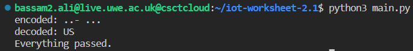
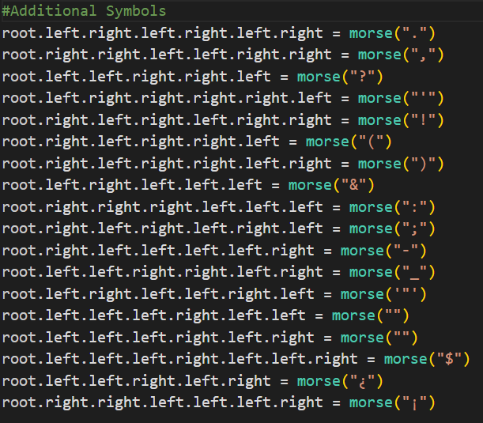

# Worksheet 2 Part 1

### morse.py uses two main functions (1) encode and (2) decode which both convert characters and symbols to morse code and vice versa

* When the program is run it prints out the binary tree used to decode the morse code in the decode function.

* And then gives the user the option to (E) encode or (D) decode, and enter the characters accordingly 

### Task 2 was to implement the two functions mentioned and make sure they work properly, and that can be seen through the image below

###### as shown in the picture in order to create spaces the "/" character must be inserted when decoding

### Task 3 was to create a simple assert test (in main.py) for the two functions implemented and another file (morseunit.py) that used the unittest library

##### In morseunit.py, it was asked to create tests for the encode and decode function. Also added tests for verifying the empty and non-empty nodes of the implemented binary tree.

1. output of main.py

2. output of morseunit.py

These are the tests that were purposely made to fail

### Task 4 was to add a set of morse encodings of more symbols, and added tests for these symbols that are included in the morseunit.py file

The additional symbols were added to both the dictionary and the binary tree

# Worksheet 2 Part 2

### Task 1 was to implement the morse decode function using a binary heap string representation by using the T[(2 * i)] formula to go left (.) and the T[(2 * i) + 1] formula to go right (-), and write the differences of each implementation used

* P.S: The "%" character represents empty nodes

* 6 unit tests were added to ensure the function is working as it should be

An example of running the code (a "/" is used to split words):

##### Differences of using a binary tree, python dictionary and binary heap to decode morse messages

According to the use of a binary tree in my code to decode messages, it stored morse code in nodes in which each node would represent a morse character '.' or '-', to decode a message it would traverse the tree based on the morse code given by the user. 

A python dictionary could've been used for both encode and decode functions, meaning the use of a dictionary is flexible, however I only implemented a dictionary for decoding morse. A dictionary would look up the corresponding value to the morse character. Using a dictionary offered flexibility and was easier to modify when needed.

Implementing the decode function using a binary heap was easier as it was a simple string array representing the binary heap. When the user enters morse code, the function uses a mathematical formula to traverse through the string to find the character and decode the message. This method was simpler to execute than using a binary tree and was easier to understand.

### Task 2 was to implement two functions (encode_ham) & (decode_ham) which are based on extended morse code used in Ham Radio conversations

* (encode_ham) asks the user to enter the sender, receiver, and the message to be sent and converts it to extended morse code as shown below

* (decode_ham) asks the user to enter the extended morse code, and decodes it to characters and symbols (the '/' character is to seperate words). It then displays in the form of a tuple the sender, receiver, and message that are in the extended morse code

